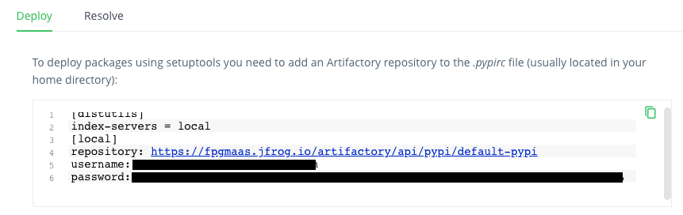

# Publishing to Pypi or Artifactory

## Releasing from Github

When `publish_to` is set to `"pypi"` or `"artifactory"`, the
`on-release-main.yml` workflow publishes the code to
[Pypi](https://pypi.org) or [Artifactory](https://jfrog.com/artifactory)
respectively whenever a [new release](./cicd.md#how-to-trigger-a-release) is made.

Before you can succesfully publish your project from the release workflow, you need to add some secrets to your github repository so
they can be used as environment variables.

## Set-up for Pypi

In order to publish to Pypi, the secret `PYPI_TOKEN` should be set in
your repository. In your Github repository, navigate to
`Settings > Secrets > Actions` and press `New repository secret`. As the
name of the secret, set `PYPI_TOKEN`. Then, in a new tab go to your
[Pypi Account settings](https://pypi.org/manage/account/) and select
`Add API token`. Copy and paste the token in the `Value`
field for the Github secret in your first tab, and you're all set!

## Set-up for Artifactory

In order to release to `Artifactory`, visit your Artifactory
instance and open `Quick setup`. You should see something like this:



You should add these as secrets to your repository with the names
`ARTIFACTORY_URL`, `ARTIFACTORY_USERNAME` and `ARTIFACTORY_PASSWORD`
respectively. To do so, in your Github repository, navigate to
`Settings > Secrets > Actions` and create a secret by pressing
`New repository secret` to add the secrets one by one.

## Publishing from your local machine

It is also possible to release locally, although it is not recommended.
To do so, set the repository secrets listed in the sections above as
environment variables on your local machine instead, and run

``` bash
make build-and-publish
```
