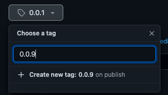

===================================
Releasing to Pypi or Artifactory
===================================

.. contents:: :local:
    :depth: 3

Releasing from Github
---------------------------------------------

When ``publish_to`` is set to ``"pypi"`` or ``"artifactory"``, the ``.github/on-release-main.yml`` publishes the code to 
`Pypi <https://pypi.org>`_ or `Artifactory <https://jfrog.com/artifactory>`_ respectively whenever a new release is made. 
To trigger this workflow, click the ``Draft a new release`` button on your repository's homepage:

Or if you fail to find it, by visiting `https://github.com/<username>/<repository-name>/releases/new`.

Add a new tag in the form ``*.*.*`` where the ``*``'s are alphanumeric.

To finish, press ``Publish release``

Before you can publish your code, you should first set your repository's secrets. 
See the following two sections on how to do so for both ``Pypi`` and ``Artifactory``

Pypi prerequisites
~~~~~~~~~~~~~~~~~~~~~~~~

In order to release to Pypi, the secret ``PYPI_TOKEN`` should be set in your repository. In your Github repository, navigate to ``Settings > Secrets > Actions`` and press
``New repository secret``. As the name of the secret, set ``PYPI_TOKEN``. Then, in a new tab go to your `Pypi Account settings <https://pypi.org/manage/account/>`_ 
and select `Add API token`. Copy and paste the token in the ``Value`` field for the Github secret in your first tab, and you're all set!

Artifactory prerequisites
~~~~~~~~~~~~~~~~~~~~~~~~~~

In order to release to `Artifactory`, visit your Artifactory instance and open ``Quick setup``. You should see something like this:

.. image:: images/artifactory.png
   :width: 700

You should add these as secrets to your repository with the names ``ARTIFACTORY_URL``, ``ARTIFACTORY_USERNAME`` and ``ARTIFACTORY_PASSWORD`` respectively.
To do so, in your Github repository, navigate to  ``Settings > Secrets > Actions`` and create a secret by pressing ``New repository secret`` to add the secrets one by one.

Releasing locally
----------------------

It is also possible to release locally, although it is not recommended. To do so, set the repository secrets listed in the sections above 
as environment variables on your local machine instead, and run

.. code-block:: bash
    
    make build-and-publish
