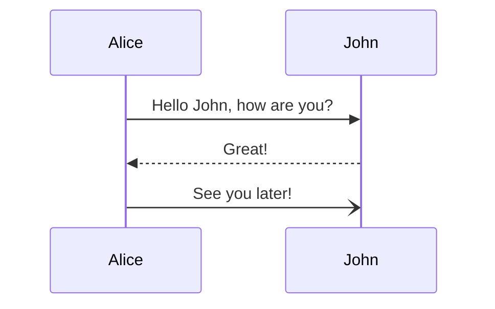

# Mermaid Diagrams

---

**WARNING**

If the rendering crashes, make sure you diagram doesn't have a frontmatter
section. If you don't know what it is, don't worry about it.

---

**If you are using Pycharm**, checkout their free [mermaid plugin](https://plugins.jetbrains.com/plugin/20146-mermaid)

## What is Mermaid?

[Mermaid](https://mermaid.js.org/) is a text based Diagramming and charting
tools very similar to plant UML.

This template is already configured to support Mermaid so all you need is
start drawing.

Inserting the following code block directy in the Markdown file produces

````
    ```mermaid
    sequenceDiagram
        Alice->>John: Hello John, how are you?
        John-->>Alice: Great!
        Alice-)John: See you later!

    ```
````

This



## Additional Notes

The template is configured properly however it was done with
[MkDocs-Mermaid2](https://mkdocs-mermaid2.readthedocs.io/en/latest/) instruction.
After installing the recommended theme extension for fencing, it crashed on the
following (defined in `mkdocs.yml` therefore, I commented it out.

```
markdown_extensions:
  - pymdownx.superfences:
        # make exceptions to highlighting of code:
      custom_fences:
        - name: mermaid
          class: mermaid
          format: !!python/name:mermaid2.fence_mermaid_custom
```

It turns out I had to force the latest version of Mermaid. Also note that
there seem to have a problem when adding Front Matter (crash) only related
to that extension.
