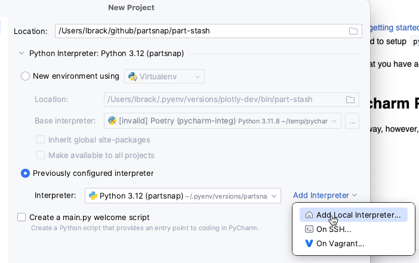
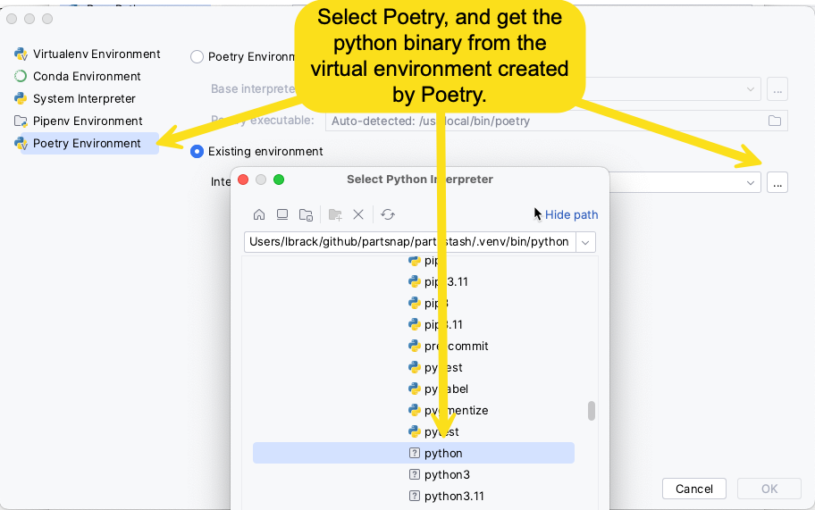
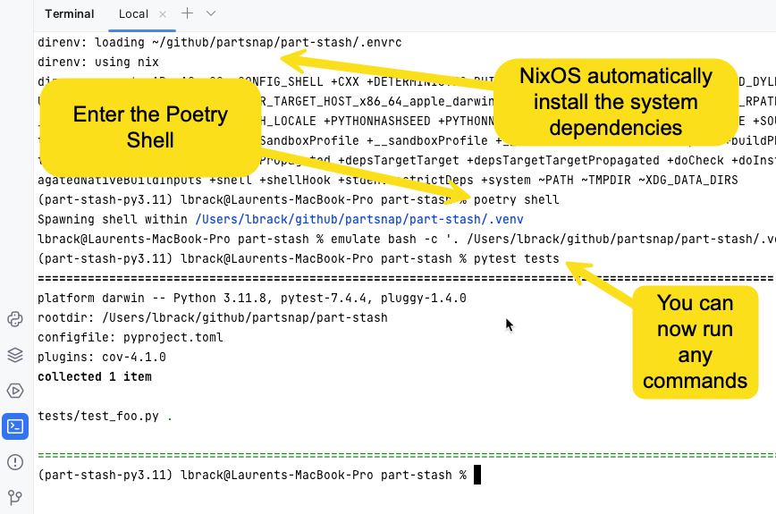
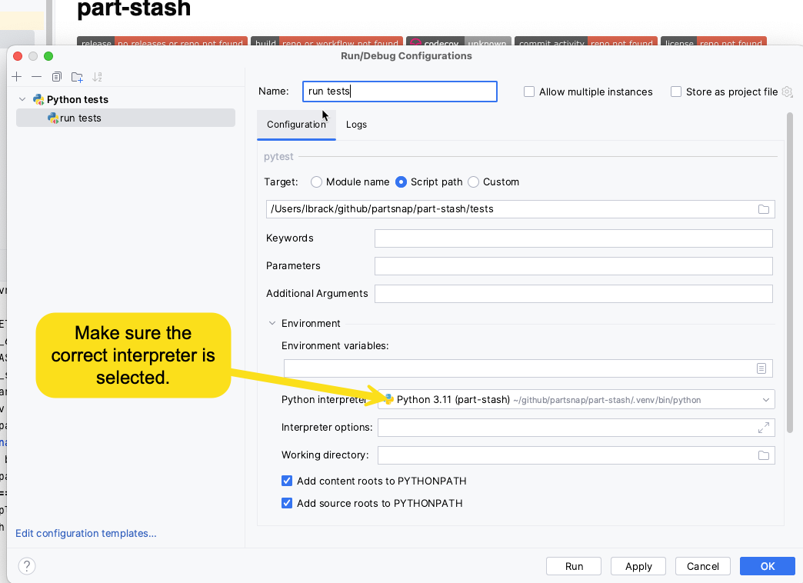
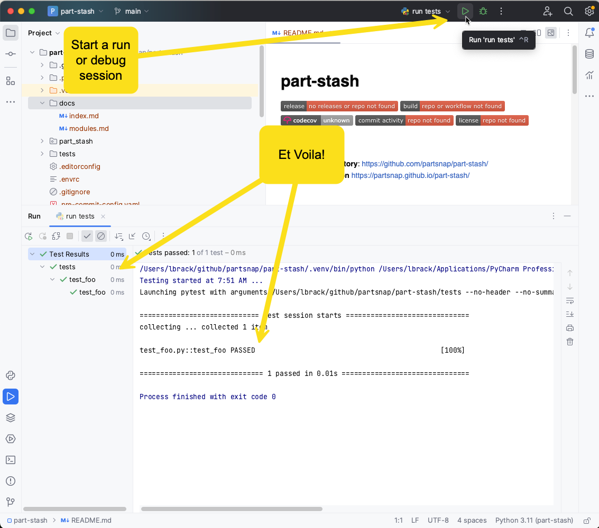

# Setting Up Pycharm with NixOS and Poetry

This tutorial explains how to get your PyCharm IDE setup with NixOS and Poetry
so that terminals and configurations work.

For basic setup, check the [getting started](./bootstrap.md). After this tutorial
you should have a project structure. Note that with NixOS, you do not need to
setup `pyenv`.

At this point, we assume that you have added your project to Git, and have installed
things with Poetry.

## Create the Pycharm Project

Create a project the usual way, however, you need the do the following for setting up
the virtual environment. You should have a `.venv` folder at the root ood your project.

- Click on _Add Local Interpreter_

- select _Poetry Environment_
- click on `...` to point Pycharm to the proper binary
- click on `python` in the `.venv` folder located at the root of the project

## Start a Terminal

Once setup, simply start a terminal, and start the [Poetry Shell](https://python-poetry.org/docs/cli#shell)
and you are all set.

## Create a Run a Configuration

Creating and running a configuration is also very simple. First, set up the
configuration.

And Run it!

