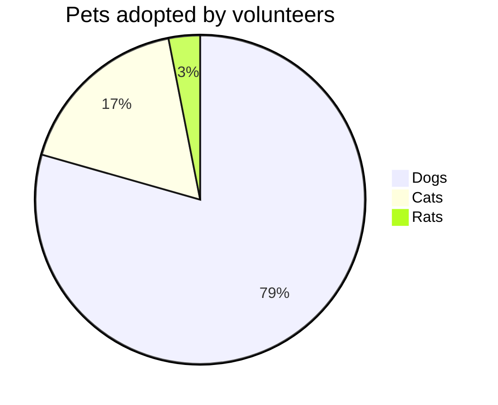

# {{cookiecutter.project_name}}

[](https://img.shields.io/github/v/release/partsnap/{{cookiecutter.project_name}})
[](https://github.com/partsnap/{{cookiecutter.project_name}}/actions/workflows/main.yml?query=branch%3Amain)
[](https://img.shields.io/github/commit-activity/m/partsnap/{{cookiecutter.project_name}})
[](https://img.shields.io/github/license/partsnap/{{cookiecutter.project_name}})

{{cookiecutter.project_description}}

Here is a simple mermaid diagram



source:

````
    ```mermaid
    pie title Pets adopted by volunteers
        "Dogs" : 386
        "Cats" : 85
        "Rats" : 15
    ```
````

For more information see the [doc on github](https://github.com/partsnap/partsnap-cookiecutter-poetry)
